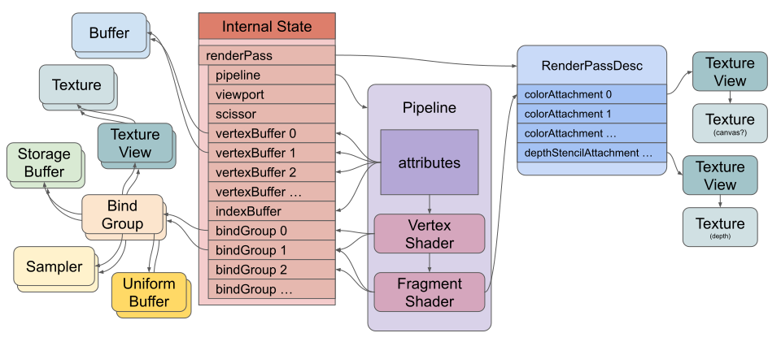
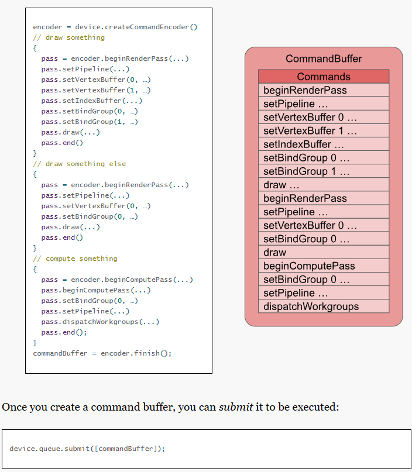

# wgsl 연습 

그래픽스 프로그래밍은 쉐이더 프로그래밍을 근간 중 하나로 한다. 

examples 폴더에 여러 예제를 추가하고 wgsl에서 로딩하여 실행하도록 한다. 

[webgpu의 예제](https://webgpu.github.io/webgpu-samples)를 추가하여 
따라가고 구현 알고리즘을 이해하도록 이해하도록 한다. 

한번에 모든 것을 알 수 없고 꽤 오랜 시간 투자해야 한다는 점을 명심한다. 

렌더링의 최종 목표는 UE5의 애셋을 머티리얼(쉐이더)을 포함하여 export 하고 
유사한 품질의 장면을 렌더링하는 것이다. 애니메이션을 포함하도록 한다. 

## WGSL 펀더멘털 

https://webgpufundamentals.org/ 

- internal state
  - render pass 
    - pipeline 
    - viewport 
    - scissor 
    - vertexBuffer 0, 1, ... 
    - indexBuffer
    - bindGroup 0, 1, 2, ... 
- Bufffer 
- TextureView 
    - Texture 
- BindGroup
  - Storage Buffer 
  - Sampler 
  - Uniform Buffer 

- Pipeline 
  - attributes : buffers 
  - vertex shader 
  - fragment shader 

- RenderPassDesc 
  - colorAttachment 0, 1, ... 
  - depthStencilAttachment ... 
  - TextureView 
    - Texture

많은 요소들이 있다. 현재의 그리기의 정수를 모아서 만든 표준이다. 

command buffer는 렌더 파이프라인을 구성하는 중요한 요소이다. 

### go에서 따라가기 

device에 만든 pipeline은 쉐이더 정의와 몇 가지 속성을 갖고 있다. 
command buffer를 통해 실제 그린다. 이 때 pipeline을 지정한다. 

